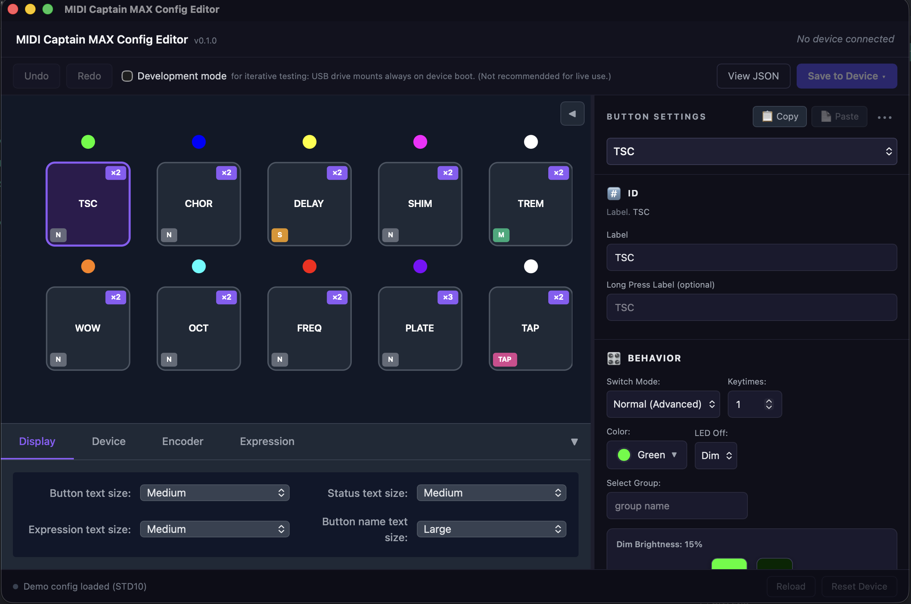

[](https://github.com/guisperandio/midi-captain-max/actions/workflows/ci.yml)

# MIDI Captain MAX Custom Firmware

**Bidirectional, config-driven CircuitPython firmware for Paint Audio MIDI Captain foot controllers.**

Includes a **GUI Config Editor**!



## What It Does

This firmware transforms your MIDI Captain into a **bidirectional MIDI controller** where your host software (DAW, plugin host) can control the device's LEDs and display, not just receive button presses.

**Button modes:** Toggle, momentary, select (radio-button groups), and tap tempo visualization. **Long-press** detection for secondary actions.

**Multi-command actions:** Each button event (press, release, long-press, long-release) can send multiple MIDI commands in sequence — change amp channel and delay preset with one footswitch!

[See here for all open features and issues](https://github.com/guisperandio/midi-captain-max/issues).

## Key Features
- 🔄 **Bidirectional MIDI** — Host can update LEDs/display state with value-based scene matching
- 📺 **Center display** — Shows button names and MIDI info with smart timeout
- ⚡ **Multi-command actions** — Send multiple MIDI messages per button press/release, each with independent channel control
- 🎯 **Device Profiles** — Built-in MIDI mappings for popular devices (Quad Cortex, Helix, Kemper, Ableton, MainStage)
- ⚙️ **Config-driven** — Visual GUI Config Editor for all settings
- 🎨 **Visual feedback** — LEDs and LCD reflect actual host state
- 🔘 **Flexible modes** — Toggle, momentary, select groups, tap tempo with accurate LED visualization
- ⏱️ **Long-press support** — Secondary actions on hold
- 🎛️ **Full input support** — Footswitches, rotary encoder, expression pedals
- 🔁 **Keytimes** — Multi-press cycling through states (like OEM SuperMode)
- 🎸 **Stage-ready** — No unexpected resets, no crashes, no surprises

## Supported Devices

| Device | Status |
|--------|--------|
| MIDI Captain STD10 (10-switch) | ✅ Fully working |
| MIDI Captain Mini6 (6-switch) | ✅ Fully working |
| 4, 2, 1-button variations | ❔ need hardware |

# Installation

1. [Download the latest firmware.zip and appropriate GUI Config Editor](https://github.com/guisperandio/midi-captain-max/releases/latest)
2. Connect your MIDI Captain via USB (hold Button 1 while powering on)
3. Copy all files and folders from the zip to the device drive (CIRCUITPY or MIDICAPTAIN)
4. On mini6, rename `config-mini6.json` to `config.json`, overwriting the existing one.
5. Power off/on or unplug and replug USB to restart

## Configuration

### Custom USB Drive Name

If you have multiple MIDI Captain devices, you can give each one a unique name! Edit the `usb_drive_name` field in `config.json`:

```json
{
  "device": "std10",
  "usb_drive_name": "MYCAPTAIN",
  ...
}
```

**Requirements:**
- Maximum 11 characters
- Letters, numbers, and underscores only
- Will be automatically converted to uppercase

The name persists across power cycles and USB disconnects. Change it anytime by editing config.json and restarting the device.

### Config Editor App (Recommended)

The **MIDI Captain MAX Config Editor** is a desktop app that makes configuration easy!

**Download for your platform:**
- **macOS:** `MIDI-Captain-MAX-Config-Editor-[version].dmg`
- **Windows:** `MIDI-Captain-MAX-Config-Editor-[version].msi` or `MIDI-Captain-MAX-Config-Editor-[version]-setup.exe`

Get the latest release from [Releases](https://github.com/guisperandio/midi-captain-max/releases/latest)

### Installation

**MacOS:**
1. Open the DMG and drag the app to your Applications folder

**Windows:**
1. Run the MSI installer or setup.exe
2. At this time, Windows builds are unsigned. Users will see a Windows SmartScreen warning.
3. To continue installation, click "More Info" --> "Run Anyway".
    - Signing certificates will be obtained in the near future.

### Usage

1. Launch the app and connect your MIDI Captain
2. Edit button labels, CC numbers, and colors using the visual editor
3. Configure Device Profiles for quick MIDI setup
4. Save directly to the device — option to safely eject when done
5. Power cycle the device to load the new settings.

# Features

- 🖱️ **Visual editing** — No JSON syntax to learn
- ✅ **Real-time validation** — Catch errors before saving
- 🎨 **Color picker** — Visual color selection
- 🔍 **Device detection** — Automatically detects connected MIDI Captain
- 🎯 **Device Profiles** — Quick setup with built-in MIDI mappings
- ⏏️ **Safe eject** — Cleanly ejects device after saving (macOS/Linux)

## Device Profiles

The config editor includes **built-in profiles** for popular music production devices, making setup faster and eliminating MIDI reference lookups.

### Included Profiles

- **Neural DSP Quad Cortex** — Scene select, stomp/preset modes, tuner
- **Line 6 Helix** — Snapshots, stomps, tap tempo, tuner
- **Line 6 HX Stomp** — Snapshots, stomps (compact 6-switch layout)
- **Kemper Profiler** — Rig select, stomp modes, tap tempo, tuner
- **Ableton Live** — Track control, clip launch, scene select, transport
- **Apple MainStage** — Patch select, bypass, tap tempo

### Using Profiles

1. Open a button in the editor
2. Enable "Use Device Profile"
3. Select your device from the dropdown
4. Choose an action (e.g., "Scene A", "Snapshot 1")
5. Assign to Press/Release/Long Press event
6. Optional: Override the MIDI channel

The editor shows a live preview of the MIDI commands that will be sent. You can mix profile actions with custom MIDI commands on the same button!

## Manual Configuration

You can also edit `config.json` directly on the device. The firmware uses an **event-based** format where each button can define multiple commands per action:

```json
{
  "device": "std10",
  "global_channel": 0,
  "usb_drive_name": "MYCAPTAIN",
  "dev_mode": false,
  "buttons": [
    {
      "label": "DELAY",
      "color": "blue",
      "mode": "toggle",
      "off_mode": "dim",
      "channel": 0,
      "press": [
        {"type": "cc", "cc": 20, "value": 127}
      ],
      "release": [
        {"type": "cc", "cc": 20, "value": 0}
      ]
    },
    {
      "label": "DRIVE",
      "color": "orange",
      "mode": "momentary",
      "press": [
        {"type": "cc", "cc": 23, "value": 127},
        {"type": "pc", "program": 5}
      ],
      "release": [
        {"type": "cc", "cc": 23, "value": 0}
      ],
      "long_press": [
        {"type": "cc", "cc": 40, "value": 127, "threshold_ms": 700}
      ],
      "long_release": [
        {"type": "cc", "cc": 40, "value": 0}
      ]
    },
    {
      "label": "CLEAN",
      "color": "green",
      "mode": "select",
      "select_group": "channel",
      "default_selected": true,
      "press": [
        {"type": "pc", "program": 0}
      ]
    },
    {
      "label": "CRCH",
      "color": "red",
      "mode": "select",
      "select_group": "channel",
      "press": [
        {"type": "pc", "program": 1}
      ]
    },
    {
      "label": "TAP",
      "color": "cyan",
      "mode": "momentary",
      "press": [
        {"type": "cc", "cc": 44, "value": 127, "channel": 0},
        {"type": "cc", "cc": 1, "value": 127, "channel": 1}
      ]
    },
    {
      "label": "VERB",
      "color": "blue",
      "mode": "toggle",
      "keytimes": 3,
      "press": [
        {"type": "cc", "cc": 20, "value": 64}
      ],
      "states": [
        {"cc": 20, "value": 64, "color": "blue", "label": "50%"},
        {"cc": 20, "value": 96, "color": "cyan", "label": "75%"},
        {"cc": 20, "value": 127, "color": "white", "label": "100%"}
      ]
    }
  ],
  "encoder": {
    "enabled": true,
    "cc": 11,
    "label": "MOD",
    "min": 0,
    "max": 127,
    "initial": 64,
    "channel": 0,
    "push": {
      "enabled": true,
      "mode": "toggle",
      "label": "PUSH",
      "cc": 14,
      "cc_on": 127,
      "cc_off": 0,
      "channel": 0
    }
  },
  "expression": {
    "exp1": {
      "enabled": true,
      "cc": 12,
      "label": "EXP1",
      "min": 0,
      "max": 127,
      "polarity": "normal",
      "threshold": 2,
      "channel": 0
    }
  },
  "display": {
    "button_text_size": "medium",
    "status_text_size": "medium",
    "expression_text_size": "medium"
  }
}
```

This example demonstrates:
- **Toggle mode** with press/release (Button 1: DELAY)
- **Momentary mode** with long-press/long-release (Button 2: DRIVE)
- **Multi-command actions** sending CC + PC simultaneously (Button 2)
- **Select groups** for radio-button behavior (Buttons 3-4: channel switching)
- **Default selected** button activated on boot (Button 3: CLEAN)
- **Per-command channels** controlling multiple devices (Button 5: TAP)
- **Keytimes** with per-state overrides (Button 6: VERB cycling 3 reverb levels)
- **Encoder** configuration with push button
- **Expression pedal** setup
- **Display** text size settings

### Button Configuration Fields

| Field | Description | Default |
|-------|-------------|---------|
| `label` | Text shown on LCD (max 6 chars) | Button number |
| `color` | Named color: `red`, `green`, `blue`, `yellow`, `cyan`, `magenta`, `orange`, `purple`, `white` | `white` |
| `mode` | Button behavior: `toggle`, `momentary`, `select`, `tap` | `toggle` |
| `off_mode` | LED when OFF: `dim` (30% brightness) or `off` (completely off) | `dim` |
| `channel` | MIDI channel (0-15) | 0 |
| `select_group` | String ID for radio-button groups (only one ON at a time) | none |
| `keytimes` | Number of states to cycle through (1-99) | 1 |
| `states` | Array of per-state overrides (for keytimes > 1) | `[]` |
| `press` | Array of commands sent on press | `[]` |
| `release` | Array of commands sent on release | `[]` |
| `long_press` | Array of commands sent on long press (with `threshold_ms`) | `[]` |
| `long_release` | Array of commands sent on release after long press | `[]` |

### Command Object Fields

| Field | Description | Types |
|-------|-------------|-------|
| `type` | Command type | `cc`, `note`, `pc`, `pc_inc`, `pc_dec` |
| `channel` | MIDI channel (0-15, optional - defaults to button or global channel) | All |
| `cc` | CC number (0-127) | `cc` |
| `value` | CC value (0-127) | `cc` |
| `note` | MIDI note (0-127) | `note` |
| `velocity` | Note velocity (0-127) | `note` |
| `program` | Program number (0-127) | `pc` |
| `pc_step` | Step value for increment/decrement | `pc_inc`, `pc_dec` |
| `threshold_ms` | Long-press threshold in milliseconds | `long_press` (first command only) |

**Per-Command Channels:**  
Each command can specify its own `channel` (0-15). This enables one button to control multiple devices:

```json
{
  "label": "TAP",
  "press": [
    {"type": "cc", "cc": 44, "value": 127, "channel": 0},  // Tap to amp on ch1
    {"type": "cc", "cc": 1, "value": 127, "channel": 1}    // Tap to delay on ch2
  ]
}
```

If `channel` is omitted, the command uses the button's `channel` field, or falls back to `global_channel` (default 0).

**Mode behaviors:**
- **`toggle`**: Alternates ON/OFF, sends `press` when ON, `release` when OFF
- **`momentary`**: ON while held, sends `press` on press, `release` on release  
- **`select`**: Always turns ON (never toggles OFF), use with `select_group`
- **`tap`**: Visual tap tempo, blinks on each press

**Select groups:**  
Buttons with the same `select_group` act like radio buttons — selecting one deselects others in the group. Works with both `toggle` and `select` modes.

### Advanced: Keytimes (Multi-Press Cycling)

**Keytimes** allows a button to cycle through multiple states on repeated presses, similar to the OEM SuperMode firmware. Each state can have different MIDI values and LED colors.

#### Example: 3-State Reverb Button

```json
{
  "label": "VERB",
  "color": "blue",
  "mode": "toggle",
  "keytimes": 3,
  "press": [
    {"type": "cc", "cc": 20, "value": 64}
  ],
  "release": [
    {"type": "cc", "cc": 20, "value": 0}
  ],
  "states": [
    {"cc": 20, "value": 64, "color": "blue"},    // State 1: 50% wet
    {"cc": 20, "value": 96, "color": "cyan"},    // State 2: 75% wet
    {"cc": 20, "value": 127, "color": "white"}   // State 3: 100% wet
  ]
}
```

- **First press**: Sends CC20=64, LED shows blue
- **Second press**: Sends CC20=96, LED shows cyan
- **Third press**: Sends CC20=127, LED shows white
- **Fourth press**: Cycles back to state 1

#### Per-State Options

Each state in the `states` array can override command values from the base `press`/`release` arrays:
- `cc`, `value`: CC command overrides
- `note`, `velocity`: Note command overrides
- `program`: PC command override
- `pc_step`: PC inc/dec step override
- `color`: LED color for this state
- `label`: Display label for this state

#### Notes

- Keytimes defaults to 1 (standard single-state behavior)
- Maximum 99 states per button
- Works with toggle, momentary, and select modes
- State overrides apply to the command values in `press`/`release` arrays

### Multi-Command Actions

Each button action can send **multiple MIDI commands in sequence**. This enables complex macros with a single footswitch press.

#### Example: Amp Channel + Delay Preset

```json
{
  "label": "CH2+DLY",
  "color": "red",
  "press": [
    {"type": "cc", "cc": 30, "value": 127},  // Switch to channel 2
    {"type": "pc", "program": 12}             // Load delay preset
  ]
}
```

#### Example: Scene Select with Expression Reset

```json
{
  "label": "SCENE3",
  "color": "purple",
  "press": [
    {"type": "pc", "program": 3},             // Load scene 3
    {"type": "cc", "cc": 12, "value": 64}     // Reset expression to middle
  ]
}
```

#### Example: Long-Press for Secondary Function

```json
{
  "label": "DELAY",
  "color": "blue",
  "press": [
    {"type": "cc", "cc": 20, "value": 127}    // Short press: delay ON
  ],
  "long_press": [
    {"type": "cc", "cc": 40, "value": 127, "threshold_ms": 700},  // Hold 700ms: tap tempo ON
    {"type": "cc", "cc": 41, "value": 64}     // Reset tap rate
  ],
  "long_release": [
    {"type": "cc", "cc": 40, "value": 0}      // Release: tap tempo OFF
  ]
}
```

## MIDI Protocol

The firmware supports **CC (Control Change)**, **Note On/Off**, and **Program Change** messages. All MIDI mappings are fully configurable via `config.json`.

### Default Device → Host Mappings

These are the default CC numbers (fully customizable):

| Input | MIDI Message |
|-------|--------------|
| Encoder wheel | CC 11 (0-127 position) |
| Encoder push | CC 14 (127=press, 0=release) |
| Footswitch 1-10 | CC 20-29 (127=ON, 0=OFF) |
| Expression 1 | CC 12 (0-127) |
| Expression 2 | CC 13 (0-127) |

### Host → Device (LED/state control)

The device responds to incoming MIDI to update button states. Send CC messages matching your button's configured `press` commands:
- `CC 20, value 127` → Button 1 turns ON (LED lights up)
- `CC 20, value 0` → Button 1 turns OFF (LED off/dim)

**Value-based scene matching:**  
The firmware matches incoming CC number, channel, **and value** against button configurations. This enables scene switching on devices like the Quad Cortex:

```json
{
  "label": "SCENE1",
  "press": [{"type": "cc", "cc": 43, "value": 0, "channel": 0}]
},
{
  "label": "SCENE2", 
  "press": [{"type": "cc", "cc": 43, "value": 1, "channel": 0}]
},
{
  "label": "SCENE3",
  "press": [{"type": "cc", "cc": 43, "value": 2, "channel": 0}]
}
```

When the Quad Cortex sends `CC 43, value 1, channel 0`, only the SCENE2 button lights up.

## Use Cases

- **Gig Performer / MainStage** — Sync button states with plugin bypass
- **Ableton Live** — Control track mutes/solos with visual feedback
- **Guitar Rig / Helix Native** — Effect on/off with LED confirmation
- **Any MIDI-capable host** — Generic CC control with bidirectional sync

## Repository Layout

| Path | Purpose |
|------|---------|
| `firmware/dev/` | Active firmware (copy to device) |
| `config-editor/` | Desktop config editor app (Tauri + Svelte) |
| `firmware/original_helmut/` | Helmut Keller's original code (reference) |
| `docs/` | Hardware specs, design docs |
| `tools/` | Helper scripts |

## License

Copyright © 2026 Maximilian Cascone. All rights reserved.

You may use this firmware freely for personal or commercial performances. Redistribution of modified versions requires permission. See [LICENSE](LICENSE) for details.

## Attribution

This project builds on work by **Helmut Keller** ([hfrk.de](https://hfrk.de)), whose original firmware demonstrated bidirectional MIDI on the MIDI Captain. His code is preserved in `firmware/original_helmut/` as a reference.

---

## Questions, Comments, Suggestions are welcome

[Open an issue](https://github.com/guisperandio/midi-captain-max/issues) or check [AGENTS.md](AGENTS.md) for developer documentation.
